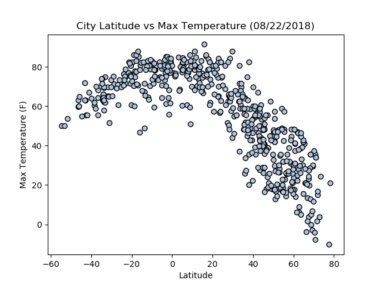
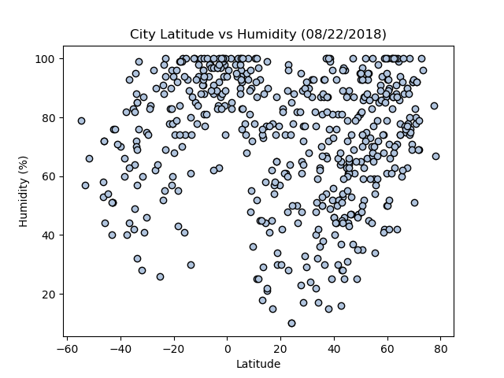

# Weather Analysis Using Open Weather API

I always follow the weather. So one day, I dedicded to do create a Python script to analyze and visualize the weather of 500+ cities across the world of varying distance from the equator.

## Prerequisites

You will need to have Python3 and Jupyter Notebook already installed on your computer, and will need to import the following libraries:
* Numpy
* Pandas
* Matplotlib
* Numpy
* Json
* Requests
* Time
* Pprint (Pretty Print To Read JSON)
* OS
* CSV
* Open Weather Map API Key (https://openweathermap.org/api - Free)
  
## Getting Started

To only view my Python script, and the output of my analysis, please click on the "OpenWeatherMapAPI_Data Analysis.ipynb", and you will be able to view it on GitHub via your web broswer.

I've provided a summary of my analysis, and included the charts below.

Otherwise, you will need to have all the prerequites installed, download / clone my repository, and open the "OpenWeatherMapAPI_Data Analysis.ipynb" file via Jupyter Notebook, and go to OpenWeatherMap.org/api to register for a free API key, as I have removed mine from the repository for security reasons.

## Summary of Analysis and Findings
* As expected, the weather becomes significantly warmer as one approaches the equator (0 Deg. Latitude). More interestingly, however, is the fact that the southern hemisphere tends to be warmer this time of year than the northern hemisphere. This may be due to the tilt of the earth.
* There is no strong relationship between latitude and cloudiness. However, it is interesting to see that a strong band of cities sits at 0, 80, and 100% cloudiness.
* There is no strong relationship between latitude and wind speed. However, in northern hemispheres there is a flurry of cities with over 20 mph of wind.

### City Latitude vs. Max Temperature As Of August 22, 2018

*	City Latitudes vs Temperatures (F) Chart:  Cities with latitudes of negative sixty to twenty had the highest temperatures. This makes sense because a latitude of zero is near Africa, which is known to be very hot and near the equator. As the city latitudes moved away from zero, the city temperatures were found to be cooler.

### City Latitude vs. Humidity As Of August 22, 2018

*	City Latitudes vs Temperatures (F) Chart:  Cities with latitudes of negative sixty to twenty had the highest temperatures. This makes sense because a latitude of zero is near Africa, which is known to be very hot and near the equator. As the city latitudes moved away from zero, the city temperatures were found to be cooler.

## Author

* **Johneson Giang** - *Individual Project* - [Github](https://github.com/jhustles)

## License

This project is licensed under the MIT License - see the [LICENSE.md](LICENSE.md) file for details
